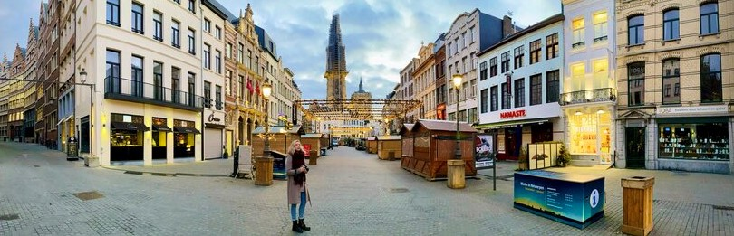

# Hi, I'm [Tenal](https://tenalbourchier.com/)! (she/her)

I’m an inquisitive frontend software developer based in Ontario, Canada, with comprehensive experience across the entire software development lifecycle — architecting, developing, testing, deploying, maintaining, and documenting complex applications. I specialize in the MERN stack and thrive in Agile environments, including fast-paced startup and fully remote teams where cross-functional collaboration and adaptability are key. I’m adept at translating complex prototypes into polished applications, refactoring legacy code, reducing technical debt, and implementing modern design strategies for optimal performance and quality.

My path into software was unconventional, but my background in marketing and law honed my creativity, problem-solving, and collaboration with diverse stakeholders. Now that I’m established in tech, I’m particularly passionate about using technology to make a meaningful impact in the world. My time at CarbonCure Technologies, a cleantech company dedicated to decarbonizing the concrete industry, reinforced my belief in leveraging software solutions to drive positive change. When I’m not coding, I’m often volunteering in the dog rescue world, travelling, gaming, hiking, horse riding, or spending time with loved ones.

I'm currently searching for my next software role, let's <a href="mailto:tenalbourchier.com">get in touch</a>! 

   
   

## Tech Stack

- **Languages:** HTML | CSS | JavaScript (ES6+) | TypeScript | C# _(🔃 learning)_
- **Frontend:** React | Next.js | React Context | Recoil.js | jQuery 
- **Styling:** Sass | Tailwind CSS | Styled Components | MUI | shadcn/ui | Storybook
- **Backend:** Node.js | Express | ASP.Net _(🔃 learning)_   
- **Data:** MongoDB | Firebase | REST APIs
- **Versioning:** Git | GitHub | GitLab | SourceTree
- **Testing:** Jest | React Testing Library | TestCafe | Cypress   
- **Collaboration:** Agile | CI/CD Tools | SonarCloud | JSDoc | Jira | Confluence | Slab | Asana | Slack | Pendo | Heap | Figma

    
## Future Projects

- **Currently working on:** creating a new portfolio + projects that represent my current skillset      
- **Currently learning:** C#, ASP.NET, & Web Architecture
- **Next, I want to learn:** Vue.js & React Native
